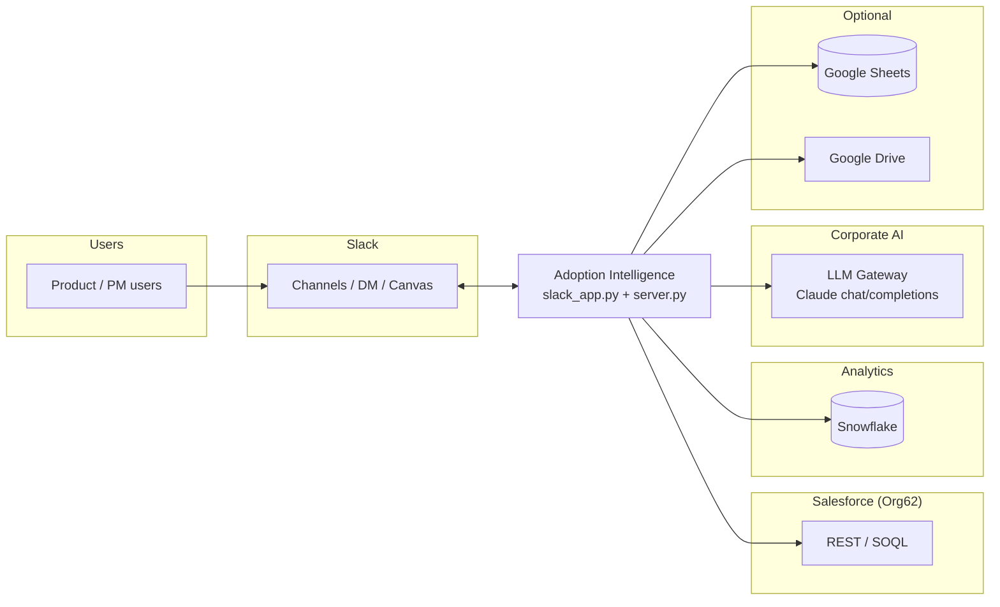
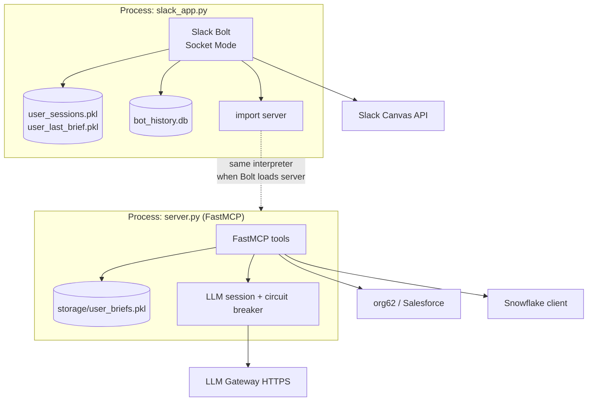
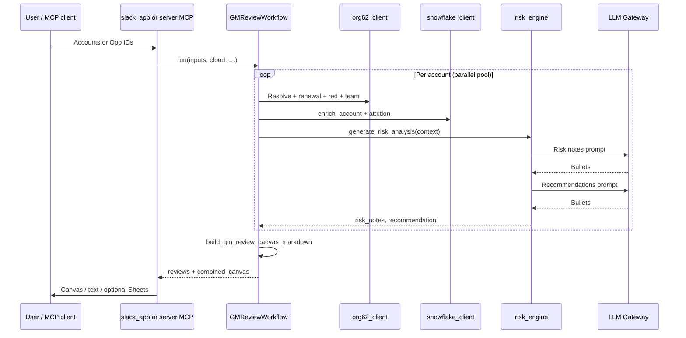
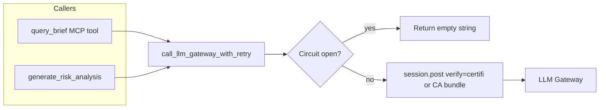

# Architecture diagrams

Companion to **`docs/ARCHITECTURE.md`**. Diagrams use [Mermaid](https://mermaid.js.org/) (renders in GitHub, many IDEs, and Cursor).

---

## 1. System context (C4-style)

Actors and external systems touching this repository.



---

## 2. Application containers

Two primary processes; MCP may run standalone (Inspector/CLI) while Slack runs Socket Mode.



---

## 3. GM Review / AI Council data flow

End-to-end for one batch of accounts (simplified).



---

## 4. LLM path (brief Q&A vs GM Review)

Shared client; GM Review uses the same gateway with shorter max_tokens in `risk_engine`.



---

## 5. ASCII summary (quick paste)

```text
                    ┌─────────────────┐
                    │  Slack / MCP    │
                    │  clients        │
                    └────────┬────────┘
                             │
              ┌──────────────┴──────────────┐
              │                             │
       ┌──────▼──────┐               ┌──────▼──────┐
       │ slack_app   │──imports──▶  │  server.py  │
       │ Bolt + UI   │               │ FastMCP     │
       └──────┬──────┘               │ + LLM       │
              │                      └──────┬──────┘
              │                             │
              └──────────────┬──────────────┘
                             │
         ┌───────────────────┼───────────────────┐
         ▼                   ▼                   ▼
   ┌──────────┐       ┌────────────┐      ┌──────────┐
   │ Salesforce│       │ Snowflake  │      │ LLM GW   │
   │ org62     │       │ analytics  │      │ HTTPS    │
   └──────────┘       └────────────┘      └──────────┘

   GM Review = GMReviewWorkflow + risk_engine + canvas_builder
```

---

For narrative and file references, see **`docs/ARCHITECTURE.md`** and **`docs/AI_COUNCIL_GM_REVIEW.md`**.
